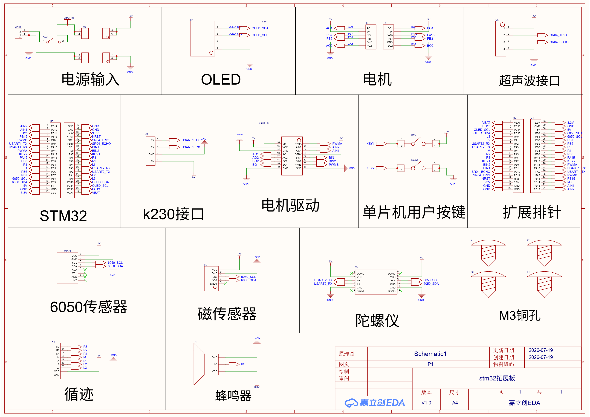

# 拓展排针引脚映射

## 编号说明

拓展排针由原理图中的 `H9` 和 `U4` 两部分组成，与 STM32F103C8T6
核心板两侧排针一一对应：

- `H9`：引脚编号为 1～20。
- `U4`：引脚编号在原理图中从上到下为 40～21。
- 下表中的方向均以原理图所示的拓展排针区域为准。实际接线时应以 PCB
  丝印和排针编号为准，不要仅凭左右位置判断。

## H9 排针（1～20）

| 排针脚号 | MCU 引脚 | 网络名 | 板载连接 / 建议用途 |
| ---: | :---: | :--- | :--- |
| 1 | VBAT | `VBAT` | 备用电池输入，用于 RTC/备份域 |
| 2 | PC13 | `PC13` | 未连接板载外设，可作 GPIO/RTC 信号 |
| 3 | PC14 | `OLED_SCL` | OLED 时钟线 |
| 4 | PC15 | `OLED_SDA` | OLED 数据线 |
| 5 | PA0 | `L3` | 循迹传感器 L3 |
| 6 | PA1 | `L2` | 循迹传感器 L2 |
| 7 | PA2 | `USART2_RX` | USART2 接收；连接陀螺仪模块 TX |
| 8 | PA3 | `USART2_TX` | USART2 发送；连接陀螺仪模块 RX |
| 9 | PA4 | `M` | 循迹传感器中间通道 M |
| 10 | PA5 | `R2` | 循迹传感器 R2 |
| 11 | PA6 | `R3` | 循迹传感器 R3 |
| 12 | PA7 | `KEY1` | 用户按键 KEY1，按下时接 3.3 V |
| 13 | PB0 | `BIN2` | 电机驱动 B 通道方向输入 2 |
| 14 | PB1 | `BIN1` | 电机驱动 B 通道方向输入 1 |
| 15 | PB10 | `SR04_ECHO` | HC-SR04 回波输入 |
| 16 | PB11 | `SR04_TRIG` | HC-SR04 触发输出 |
| 17 | NRST | `NRST` | MCU 低电平复位 |
| 18 | 3.3 V | `3.3V` | 3.3 V 电源 |
| 19 | GND | `GND` | 电源地 |
| 20 | GND | `GND` | 电源地 |

## U4 排针（40～21）

| 排针脚号 | MCU 引脚 | 网络名 | 板载连接 / 建议用途 |
| ---: | :---: | :--- | :--- |
| 40 | 3.3 V | `3.3V` | 3.3 V 电源 |
| 39 | GND | `GND` | 电源地 |
| 38 | 5 V | `5V` | 5 V 电源 |
| 37 | PB9 | `6050_SDA` | MPU6050 与磁传感器 I2C 数据线 |
| 36 | PB8 | `6050_SCL` | MPU6050 与磁传感器 I2C 时钟线 |
| 35 | PB7 | `PB7` | 未连接板载外设，可作 GPIO |
| 34 | PB6 | `PB6` | 未连接板载外设，可作 GPIO |
| 33 | PB5 | `L1` | 循迹传感器 L1 |
| 32 | PB4 | `R1` | 循迹传感器 R1 |
| 31 | PB3 | `PB3` | 未连接板载外设，可作 GPIO |
| 30 | PA15 | `PA15` | 未连接板载外设，可作 GPIO |
| 29 | PA12 | `KEY2` | 用户按键 KEY2，按下时接 GND |
| 28 | PA11 | `PWMA` | 电机驱动 A 通道 PWM |
| 27 | PA10 | `USART1_RX` | USART1 接收；连接 K230 模块 TX |
| 26 | PA9 | `USART1_TX` | USART1 发送；连接 K230 模块 RX |
| 25 | PA8 | `PWMB` | 电机驱动 B 通道 PWM |
| 24 | PB15 | `PB15` | 未连接板载外设，可作 GPIO |
| 23 | PB14 | `I/O` | 蜂鸣器控制信号 |
| 22 | PB13 | `AIN1` | 电机驱动 A 通道方向输入 1 |
| 21 | PB12 | `AIN2` | 电机驱动 A 通道方向输入 2 |

## 按功能归类

| 功能 | 信号与 MCU 引脚 |
| :--- | :--- |
| OLED | `OLED_SCL` = PC14，`OLED_SDA` = PC15 |
| MPU6050 / 磁传感器 I2C | `6050_SCL` = PB8，`6050_SDA` = PB9 |
| K230 串口 | `USART1_TX` = PA9，`USART1_RX` = PA10 |
| 陀螺仪串口 | `USART2_TX` = PA3，`USART2_RX` = PA2 |
| 超声波 | `SR04_TRIG` = PB11，`SR04_ECHO` = PB10 |
| 电机 A | `PWMA` = PA11，`AIN1` = PB13，`AIN2` = PB12 |
| 电机 B | `PWMB` = PA8，`BIN1` = PB1，`BIN2` = PB0 |
| 用户按键 | `KEY1` = PA7（按下为高），`KEY2` = PA12（按下为低） |
| 循迹传感器 | `L3` = PA0，`L2` = PA1，`L1` = PB5，`M` = PA4，`R1` = PB4，`R2` = PA5，`R3` = PA6 |
| 蜂鸣器 | `I/O` = PB14 |

## 使用注意

- STM32F103 的 GPIO 工作电平为 3.3 V。`5V` 引脚是电源引脚，不代表所有
  GPIO 都可直接接入 5 V 信号。
- `SR04_ECHO` 来自 5 V 供电的 HC-SR04；使用前应确认板上或模块输出是否已做
  3.3 V 电平兼容处理。
- PA15、PB3、PB4 默认可能被 JTAG 占用。将它们用作普通 GPIO 时，需要关闭
  JTAG 并保留 SWD 调试接口。
- PC14、PC15 的驱动能力和速度有限，适合当前原理图中的低速 OLED 软件时序，
  不建议用于大电流或高速负载。
- 同一网络已经连接板载外设时，外接模块不可与板载器件同时以推挽方式驱动该
  信号，以免产生电平冲突。
